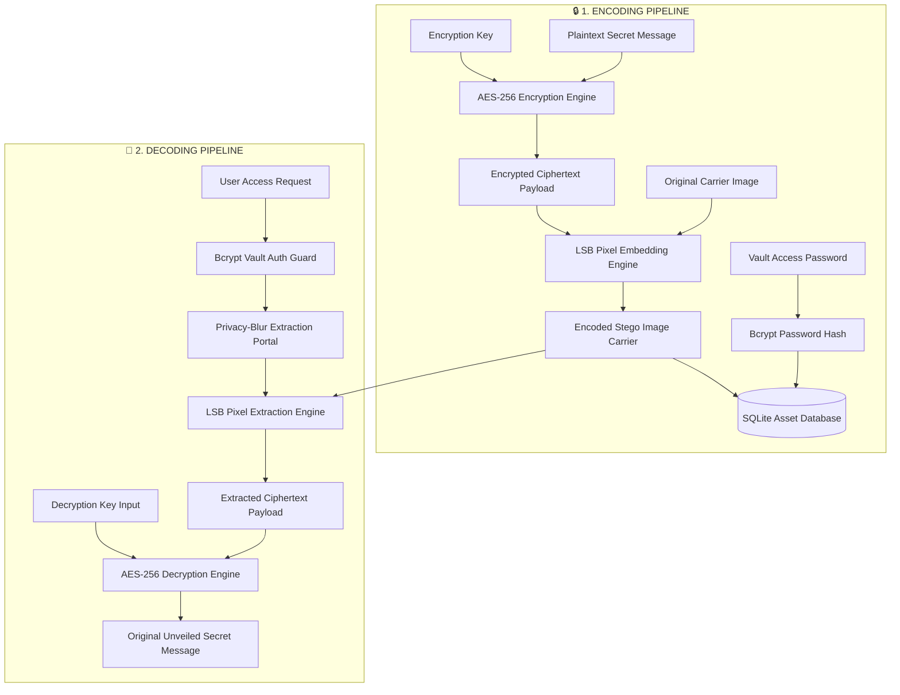

<div align="center">

  

  <h3><font color="#00F2FE">🛡️ Next-Generation Steganographic Cyber-Vault & Encrypted Communication Portal</font></h3>

  <p align="center">
    <strong><font color="#FF2A6D">Invisible Data Embedding</font> &bull; <font color="#00F2FE">AES-256 Encryption</font> &bull; <font color="#05D54B">Bcrypt Vault Protection</font> &bull; <font color="#FFC107">One-Click Cryptographic Purge</font></strong>
  </p>

  <p align="center">
    <a href="https://python.org"></a>
    <a href="https://flask.palletsprojects.com/"></a>
    <a href="https://pycryptodome.readthedocs.io/"></a>
    <a href="https://pillow.readthedocs.io/"></a>
    <a href="https://sqlite.org/"></a>
    <a href="https://chartjs.org/"></a>
  </p>

  <p align="center">
    <a href="#-executive-overview"><b><font color="#00F2FE">Overview</font></b></a> &bull;
    <a href="#-key-features"><b><font color="#FF2A6D">Features</font></b></a> &bull;
    <a href="#-system-architecture--workflow"><b><font color="#05D54B">Architecture</font></b></a> &bull;
    <a href="#-tech-stack--engineering-specs"><b><font color="#9D4EDD">Tech Stack</font></b></a> &bull;
    <a href="#-quick-start--execution"><b><font color="#FFC107">Quick Start</font></b></a> &bull;
    <a href="#-cryptographic--security-specifications"><b><font color="#00F2FE">Security Specs</font></b></a>
  </p>

  <hr width="100%" size="1" color="#1F2937" />
</div>

<br />

## 🌟 <font color="#00F2FE">Executive Overview</font>

<font color="#00F2FE"><b>STEG</b></font> is a flagship high-integrity security suite engineered for ultra-confidential data transmission. By synergizing <font color="#FF2A6D"><b>AES-256 symmetric cipher encryption</b></font> with <font color="#05D54B"><b>24-bit RGB Least Significant Bit (LSB) steganography</b></font>, STEG transforms ordinary image files into cryptographically sealed, visually indistinguishable data carriers. 

Even if an image carrier is intercepted by unauthorized entities, the payload remains double-shielded—imperceptible to manual visual analysis and cryptographically unbreakable without the private decryption key.

<div align="center">

<table width="100%">
  <thead>
    <tr style="background-color: #0d1117;">
      <th width="22%" align="center"><font color="#00F2FE"><b>Defense Layer</b></font></th>
      <th width="28%" align="center"><font color="#FF2A6D"><b>Mechanism</b></font></th>
      <th width="25%" align="center"><font color="#05D54B"><b>Cryptographic Principle</b></font></th>
      <th width="25%" align="center"><font color="#FFC107"><b>Target Threat Neutralized</b></font></th>
    </tr>
  </thead>
  <tbody>
    <tr>
      <td align="center"><b><font color="#00F2FE">Layer 1: Confidentiality</font></b></td>
      <td align="center"><code>AES-256 Payload Cipher</code></td>
      <td align="center">Symmetric Key Derivation</td>
      <td align="center"><font color="#FF5555">Unauthorized Data Extraction</font></td>
    </tr>
    <tr>
      <td align="center"><b><font color="#FF2A6D">Layer 2: Invisibility</font></b></td>
      <td align="center"><code>Spatial LSB Shading</code></td>
      <td align="center">RGB Color Channel Shifting</td>
      <td align="center"><font color="#FF5555">Visual & Statistical Detection</font></td>
    </tr>
    <tr>
      <td align="center"><b><font color="#05D54B">Layer 3: Access Control</font></b></td>
      <td align="center"><code>Bcrypt Vault Passwords</code></td>
      <td align="center">Salted Work-Factor Hashing</td>
      <td align="center"><font color="#FF5555">Unauthorized Vault Access</font></td>
    </tr>
    <tr>
      <td align="center"><b><font color="#FFC107">Layer 4: Erasure</font></b></td>
      <td align="center"><code>One-Click Purge Pipeline</code></td>
      <td align="center">Instant Storage Shredding</td>
      <td align="center"><font color="#FF5555">Data Persistence Risks</font></td>
    </tr>
  </tbody>
</table>

</div>

<br />

---

## ⚡ <font color="#FF2A6D">Key Features</font>

<table width="100%">
  <tr>
    <td width="50%" valign="top" style="border: 1px solid #1f2937; border-radius: 8px; padding: 15px;">
      <h3 align="left"><font color="#00F2FE">🔐 Dual-Layer Defense Architecture</font></h3>
      <p>Messages undergo <font color="#FF2A6D"><b>AES-256 symmetric encryption</b></font> using a user-specified key prior to spatial embedding, guaranteeing payload privacy even if steganographic algorithms are inspected.</p>
    </td>
    <td width="50%" valign="top" style="border: 1px solid #1f2937; border-radius: 8px; padding: 15px;">
      <h3 align="left"><font color="#05D54B">👁️‍🗨️ Zero-Distortion LSB Embedding</font></h3>
      <p>Utilizes <font color="#05D54B"><b>Least Significant Bit manipulation</b></font> across RGB image channels. Alters pixel values by microscopic amounts to maintain zero perceptual quality loss.</p>
    </td>
  </tr>
  <tr>
    <td width="50%" valign="top" style="border: 1px solid #1f2937; border-radius: 8px; padding: 15px;">
      <h3 align="left"><font color="#9D4EDD">🛡️ Bcrypt Cyber-Vault Portal</font></h3>
      <p>Access to encoded assets is guarded by <font color="#9D4EDD"><code>bcrypt</code> <b>hashed access credentials</b></font>. Database records contain zero plaintext secret keys or passwords.</p>
    </td>
    <td width="50%" valign="top" style="border: 1px solid #1f2937; border-radius: 8px; padding: 15px;">
      <h3 align="left"><font color="#FFC107">🌫️ Privacy-Blurred Decode Gateway</font></h3>
      <p>Decryption portal features client-side <font color="#FFC107"><b>privacy blur layers</b></font>, requiring multi-factor authentication steps (Vault Password + Decryption Key) to unveil data.</p>
    </td>
  </tr>
  <tr>
    <td width="50%" valign="top" style="border: 1px solid #1f2937; border-radius: 8px; padding: 15px;">
      <h3 align="left"><font color="#00F2FE">📊 Interactive Asset Dashboard</font></h3>
      <p>Futuristic cyber-vault console for managing steganographic assets, tracking creation dates, and viewing real-time asset metrics powered by <font color="#00F2FE"><b>Chart.js</b></font>.</p>
    </td>
    <td width="50%" valign="top" style="border: 1px solid #1f2937; border-radius: 8px; padding: 15px;">
      <h3 align="left"><font color="#FF5555">💥 Cryptographic One-Click Purge</font></h3>
      <p>Execute immediate, irreversible removal of carrier image files and SQLite relational records upon completing sensitive communications with <font color="#FF5555"><b>zero trace remaining</b></font>.</p>
    </td>
  </tr>
</table>

<br />

---

## 🏗️ <font color="#05D54B">System Architecture & Workflow</font>

<div align="center">

### 🔄 <font color="#00F2FE">Visual Execution Pipeline</font>

<table width="100%">
  <tr>
    <td width="50%" align="center" style="border: 1px solid #00F2FE; border-radius: 8px; padding: 12px;">
      <h4><font color="#00F2FE">🔒 ENCODING PIPELINE</font></h4>
      <p><code>Plaintext Message</code> ➔ <b><font color="#FF2A6D">AES-256 Encrypt</font></b> ➔ <code>Ciphertext</code></p>
      <p><code>Original Image</code> ➔ <b><font color="#05D54B">LSB Pixel Embed</font></b> ➔ <code>Stego Carrier</code></p>
      <p><code>Vault Password</code> ➔ <b><font color="#9D4EDD">Bcrypt Hash</font></b> ➔ <code>SQLite DB Storage</code></p>
    </td>
    <td width="50%" align="center" style="border: 1px solid #FF2A6D; border-radius: 8px; padding: 12px;">
      <h4><font color="#FF2A6D">🔑 DECODING PIPELINE</font></h4>
      <p><code>User Request</code> ➔ <b><font color="#9D4EDD">Bcrypt Vault Auth</font></b> ➔ <code>Access Granted</code></p>
      <p><code>Stego Carrier</code> ➔ <b><font color="#05D54B">LSB Pixel Extract</font></b> ➔ <code>Ciphertext</code></p>
      <p><code>Ciphertext</code> + <code>Key</code> ➔ <b><font color="#00F2FE">AES-256 Decrypt</font></b> ➔ <code>Unveiled Secret</code></p>
    </td>
  </tr>
</table>

</div>

<br />



<br />

---

## 🛠️ <font color="#9D4EDD">Tech Stack & Engineering Specs</font>

<div align="center">

| Category | Technology Badge | Usage & Engineering Purpose |
| :--- | :--- | :--- |
| **Backend Engine** |   | <font color="#00F2FE">Core micro-framework handling server routing, payload processing, and asset lifecycle</font> |
| **Cryptography** |   | <font color="#FF2A6D">High-performance AES-256 symmetric encryption and salted password hashing</font> |
| **Image Processing** |  | <font color="#05D54B">Spatial domain pixel buffer manipulation for 24-bit RGB LSB steganography</font> |
| **Database** |  | <font color="#9D4EDD">Relational data persistence for asset metadata, hashed access keys, and cipher pointers</font> |
| **Frontend UI/UX** |    | <font color="#FFC107">Custom Cyberpunk Glassmorphism UI with responsive design tokens</font> |
| **Visuals & UX** |    | <font color="#00F2FE">Dynamic interactive charts, scroll animations, and context-aware alerts</font> |

</div>

<br />

---

## 📂 <font color="#FFC107">Repository Structure</font>

```gcode
STEG/
├── 📄 app.py                  # Core Flask Application Server & Route Handlers
├── 📄 config.py               # Application Constants & Directory Configurations
├── 📄 requirements.txt        # Python Dependency Manifest
├── 📄 cleanup_db.py           # Utility Script for Database Maintenance
│
├── 📁 auth/                   # Authentication & Security Module
│   └── 📄 password_utils.py   # Bcrypt Hashing & Password Verification Logic
│
├── 📁 crypto/                 # Cryptographic Processing Engine
│   ├── 📄 encrypt.py          # AES-256 Message Encryption Handler
│   └── 📄 decrypt.py          # AES-256 Message Decryption Handler
│
├── 📁 stego/                  # Steganographic Processing Module
│   ├── 📄 embed.py            # LSB Image Embedding Algorithm
│   └── 📄 extract.py          # LSB Image Extraction Algorithm
│
├── 📁 database/               # Data Persistence Layer
│   ├── 📄 db.py               # SQLite Connection Provider
│   ├── 📄 init_db.py          # Database Schema Initialization Script
│   ├── 📄 models.py            # Schema Definitions (Images & Messages)
│   └── 📄 steg.db             # Local Relational Database Storage
│
├── 📁 templates/              # Glassmorphism HTML5 Views
│   ├── 📄 base.html           # Master Layout Template
│   ├── 📄 index.html          # Portal Landing Page
│   ├── 📄 encode.html         # Data Encoding Portal
│   ├── 📄 dashboard.html      # Asset Management Vault
│   ├── 📄 access.html         # Vault Access Guard
│   └── 📄 decode.html         # Privacy Blur Decryption Portal
│
└── 📁 static/                 # Static Assets & Styling System
    ├── 📁 css/                # Custom Glassmorphism Stylesheets
    ├── 📁 js/                 # Client-side Scripts & Integrations
    ├── 📁 img/                # UI Graphical Assets
    └── 📁 uploads/            # Encoded & Original Image Repositories
```

<br />

---

## 🚀 <font color="#00F2FE">Quick Start & Execution</font>

### 1. Prerequisites
Ensure **Python 3.8+** is installed on your local environment.

### 2. Installation & Virtual Environment
```bash
# Clone the repository
git clone https://github.com/vigneshaadepu/Steganography.git
cd Steganography

# Create and activate a virtual environment (Recommended)
python -m venv venv
# On Windows:
venv\Scripts\activate
# On Linux/macOS:
source venv/bin/activate

# Install required dependencies
pip install -r requirements.txt
```

### 3. Initialize Database
Initialize the SQLite storage schema:
```bash
python database/init_db.py
```

### 4. Launch Application
Start the local development server:
```bash
python app.py
```
Open your browser and navigate to **`http://127.0.0.1:5000`**.

<br />

---

## 🔬 <font color="#00F2FE">Cryptographic & Security Specifications</font>

<div align="center">

<table width="100%">
  <thead>
    <tr style="background-color: #0d1117;">
      <th width="25%" align="left"><font color="#00F2FE"><b>Security Dimension</b></font></th>
      <th width="30%" align="left"><font color="#FF2A6D"><b>Specification Standard</b></font></th>
      <th width="45%" align="left"><font color="#05D54B"><b>Technical Defense Guarantee</b></font></th>
    </tr>
  </thead>
  <tbody>
    <tr>
      <td><b><font color="#00F2FE">Payload Encryption</font></b></td>
      <td><code>AES-256 Cipher</code></td>
      <td><font color="#00F2FE">PyCryptodome block cipher providing military-grade encryption prior to stego embedding.</font></td>
    </tr>
    <tr>
      <td><b><font color="#FF2A6D">Steganographic Method</font></b></td>
      <td><code>Spatial LSB 24-bit RGB</code></td>
      <td><font color="#FF2A6D">Modifies least significant bits of pixel buffers with 0% visual distortion or degradation.</font></td>
    </tr>
    <tr>
      <td><b><font color="#05D54B">Vault Access Protection</font></b></td>
      <td><code>Bcrypt Salted Work-Factor</code></td>
      <td><font color="#05D54B">Adaptive salted hashing guarding database entries against dictionary & brute-force attacks.</font></td>
    </tr>
    <tr>
      <td><b><font color="#9D4EDD">Key Storage Policy</font></b></td>
      <td><code>Zero-Knowledge Architecture</code></td>
      <td><font color="#9D4EDD">Encryption keys and plaintext messages are never stored on server disk or database.</font></td>
    </tr>
    <tr>
      <td><b><font color="#FFC107">Carrier Image Integrity</font></b></td>
      <td><code>Lossless Perception Profile</code></td>
      <td><font color="#FFC107">Maintains 100% PSNR visual fidelity; indistinguishable color histogram signatures.</font></td>
    </tr>
    <tr>
      <td><b><font color="#FF5555">Asset Purge Protocol</font></b></td>
      <td><code>Cryptographic Destruction</code></td>
      <td><font color="#FF5555">Instant simultaneous shredding of carrier image files and relational DB records.</font></td>
    </tr>
  </tbody>
</table>

</div>

<br />

---

<div align="center">

  <hr width="100%" size="1" color="#1F2937" />

  <p align="center">
    <strong><font color="#00F2FE">STEG</font> | <font color="#FF2A6D">Secure Steganographic Communication System</font></strong>
  </p>

  <p align="center">
    <a href="#top"><b><font color="#00F2FE">⬆ Back to Top</font></b></a>
  </p>

  <p align="center">
    <sub>Engineered with precision by <strong>Antigravity AI</strong></sub>
  </p>

</div>
